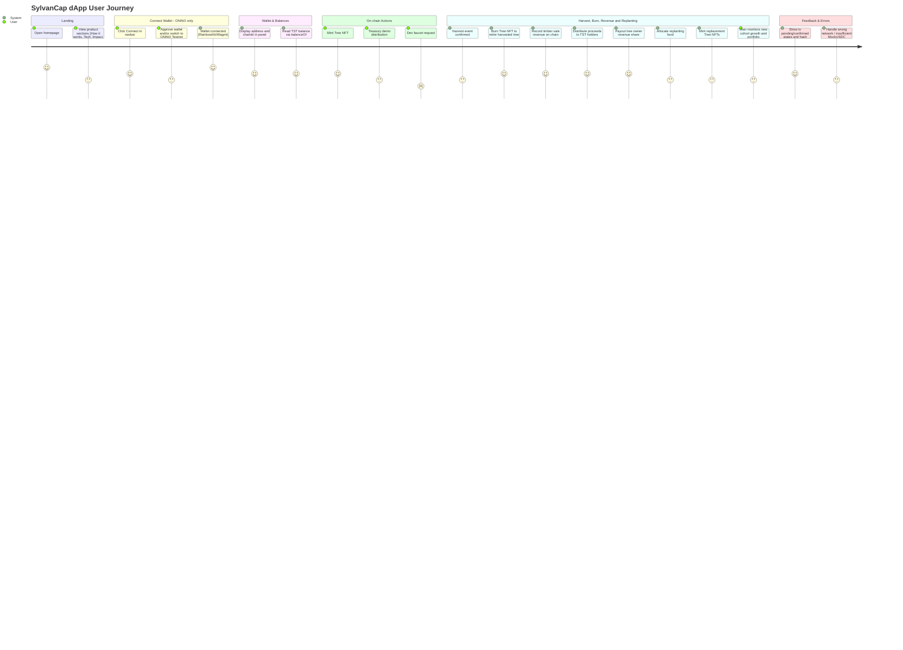

# SylvanCap

## Overview

SylvanCap is a revolutionary Web3 platform that bridges sustainable forestry and decentralized finance (DeFi) by tokenizing individual trees as a RWA on the blockchain. We tokenize managed commercial timberland on Ethereum, transforming illiquid forestry assets into dynamic, composable digital assets. We go beyond simple tokenization by creating a dual-token economy that pools risk and reward, ensuring financial returns for investors regardless of the fate of any single tree. This creates a globally accessible, liquid, and transparent market for sustainable forestry, directly aligning economic incentives with ecological health.

Our mission is to democratize access to forestry investments while promoting sustainable forest management across African ecosystems.

## Cohort Genesis 

Find the updates of each week of Onino that gave us the time and mentorship to move this idea to a prototype and launch it our users with their RWA tokenization infrastructure

[Weekly Progress & Updates](https://github.com/Bratipah/sylvan-cap/blob/main/UPDATES.md)

## 🌍 The Problem We Solve

Traditional forestry investments require:
- High minimum investments (typically $100K+)
- 15-25 year lock-up periods with no liquidity
- Complex legal structures and paperwork
- Limited transparency in forest management
- Geographic restrictions for investors
- Inefficient Revenue Models: Projects often rely on a single payout at harvest, making them vulnerable to price fluctuations and environmental disasters, with no mechanism to monetize ecosystem services like carbon sequestration during the growth phase.

## 💡 Our Solution: Dual-Token Ecosystem

- **Democratization of Capital**: By fractionalizing forests into tradable Tree NFTs, we open investment to a global pool of retail and institutional investors, providing projects with faster, more efficient access to capital.

- **Instant Liquidity Creation**: Our NFT marketplace and fungible TST token create a secondary market for forestry assets, allowing investors to exit or trade positions long before trees mature, transforming a stagnant asset into a dynamic one.

- **Diversified, Resilient Yield**: Timber Share Token (TST): Provides exposure to the traditional timber sale.

- **Carbon Credit Token (CCT)**: Generates immediate, annual revenue from carbon credits, de-risking the long wait for harvest and creating a more stable cash flow.

- **Insurance Backing**: The "Mature or Dead" guarantee protects capital against environmental risks.

- **Radical Transparency and Verification**:

- **Immutable Proof**: Each tree's location, species, and planting date are permanently recorded on-chain.

- **Oracle-Verified Data**: Satellite imagery (e.g., Planet Labs) and IoT sensors provide objective, tamper-proof proof of life, growth, and sustainable management practices for investors and carbon verifiers alike.

### Tree NFTs (ERC-721)
- **Ownership**: Each NFT represents ownership of a specific tree or tree batch
- **Metadata**: Species, location (GPS), planting date, estimated maturity
- **Liquidity**: Tradeable on secondary markets (OpenSea, custom marketplace)
- **Transparency**: Real-time growth tracking via satellite data

### Timber Share Tokens (TST - ERC-20)
- **Revenue Rights**: Represents share in future timber revenue from entire forest
- **Risk Mitigation**: Pooled across all trees to reduce individual tree risk
- **Rewards**: Distributed when trees are harvested OR when trees die (insurance-backed)
- **Governance**: Vote on key forestry management decisions

## 🔗 Integration with ONINO Blockchain

SylvanCap leverages the **ONINO Tokenization Platform** to enhance our tree tokenization capabilities:

### Why ONINO?

1. **No-Code Tokenization**: ONINO's platform allows us to create and manage complex tokenization projects without extensive coding, accelerating deployment across different African regions.

2. **Regulatory Compliance**: ONINO provides built-in legal guardrails and compliance frameworks essential for tokenizing real-world assets (RWAs) like trees across multiple African jurisdictions.

3. **Payment Integration**: Seamless fiat-to-crypto onboarding for traditional investors unfamiliar with Web3, crucial for African market adoption.

4. **White-Label Solutions**: Deploy region-specific SylvanCap instances for different African countries with local compliance and currency support.

5. **Smart Contract Management**: ONINO's infrastructure handles complex smart contract deployment and management, ensuring security and reliability.

### Technical Integration

\`\`\`mermaid
graph TD
    A[ONINO Tokenization Platform] --> B[SylvanCap Tree NFTs]
    A --> C[TST Token Management]
    A --> D[Compliance Framework]
    A --> E[Payment Processing]
    
    B --> F[African Forest Assets]
    C --> G[Revenue Distribution]
    D --> H[Multi-Jurisdiction Support]
    E --> I[Fiat On-Ramp]
    
    F --> J[Sustainable Forestry]
    G --> K[Investor Returns]
    H --> L[Legal Compliance]
    I --> M[Mass Adoption]
\`\`\`

## 🌳 How It Works

### 1. Tree Acquisition & Tokenization
- Purchase managed commercial timberland in Africa
- Survey and catalog individual trees with GPS coordinates
- Mint Tree NFTs using ONINO's tokenization platform
- Issue corresponding TST tokens to NFT holders

### 2. The "Mature or Dead" Guarantee
**Tree Matures**: Revenue from timber sale distributed to TST holders
**Tree Dies**: Insurance payout distributed to TST holders

This ensures investors receive returns regardless of individual tree outcomes.

### 3. Verification & Oracles
- Satellite imagery for growth monitoring
- IoT sensors for environmental data
- Independent forestry audits
- Blockchain oracles for data verification

##  Visualizing the Enhanced User Journey

## Reward Distribution

## 🧭 dApp User Journey

## 🚀 Technology Stack

| Component | Technology | Purpose |
|-----------|------------|---------|
| **Tokenization Platform** | ONINO | No-code asset tokenization and management |
| **Blockchain** | ONINO Layer-1 | High-performance, scalable infrastructure |
| **Tree NFTs** | ERC-721 | Represents ownership of a specific, geolocated tract of timberland.|
| **Forest NFTs** | ERC-6551 | A unique digital twin of a physical tree. Functions as its own wallet, holding TST and CCT.
| **Revenue Tokens** | ERC-20 (TST) | A fungible token representing a share in the pooled revenue from all timber sales and insurance payouts.|
| **Oracles** | Chainlink + ONINO | External data verification |
| **Storage** | IPFS/Arweave | Immutable metadata storage |
| **Governance** | ONINO DAO Tools | Community decision making |

## 🌍 African Focus

### Target Regions
- **Kenya**: Fast-growing eucalyptus and pine plantations
- **Ghana**: Sustainable teak and mahogany forests
- **South Africa**: Commercial pine and wattle plantations
- **Uganda**: Tropical hardwood reforestation projects

### Local Impact
- Job creation in rural communities - Partner forestry operations require local labor for planting, maintenance, and protection, creating stable employment.
- Sustainable forest management practices - DAO governance and on-chain verification incentivize and enforce ecological best practices, combating deforestation.
- Carbon credit generation - Projects contribute directly to global carbon drawdown efforts, financed by the voluntary carbon market.
- Biodiversity conservation 
- Economic development through Web3 technology

## 📊 Investment Metrics

### Historical Forestry Returns
- **Average Annual Return**: 8-12%
- **Inflation Hedge**: Strong correlation with inflation
- **Low Correlation**: Independent of stock market volatility
- **ESG Compliance**: Environmental and social impact

### SylvanCap Advantages
- **Liquidity**: Trade anytime on secondary markets
- **Fractional Ownership**: Invest from $50 minimum
- **Transparency**: Real-time forest monitoring
- **Global Access**: Invest from anywhere in the world

## 🛡️ Risk Management

### Insurance Coverage
- Comprehensive forest insurance against fire, disease, storms
- Parametric insurance triggered by satellite data
- Reinsurance partnerships with major providers

### Diversification
- Multiple species across different regions
- Staggered planting and harvesting schedules
- Climate-resilient forest management practices

## 🏗️ Development Roadmap

### Phase 1: Foundation (Q1-Q2 2024)
- [x] Website and platform development
- [x] ONINO integration setup
- [ ] Smart contract development and audit.
- [ ] Legal framework establishment
- [ ] Seed round NFT/TST sale.

### Phase 2: Launch (Q3-Q4 2024)
- [ ] Beta platform launch
- [ ] First Tree NFT collection mint
- [ ] Mint Genesis Forest NFT and first 10,000 Tree NFTs.
- [ ] Community building and partnerships
- [ ] Establish initial liquidity pools.
- [ ] Regulatory approvals

### Phase 3: Expansion (2025)
- [ ] Multi-country deployment
- [ ] Advanced monitoring systems
- [ ] Carbon credit integration
- [ ] Institutional investor onboarding

## 🤝 Partnerships

### Forestry Management
- Certified sustainable forestry companies
- Local community cooperatives
- Environmental monitoring organizations

### Technology Partners
- **ONINO**: Core tokenization infrastructure
- **Chainlink**: Oracle services
- **Satellite Data Providers**: Growth monitoring
- **Insurance Companies**: Risk coverage

## 📈 Tokenomics

### Tree NFT Pricing
- Based on species, location, and growth potential
- Dynamic pricing based on market demand
- Secondary market trading fees: 2.5%

### TST Token Distribution
- 70% to Tree NFT holders (vested over tree lifecycle)
- 20% to SylvanCap treasury
- 10% to forestry management partners

## 🌱 Environmental Impact

### Sustainability Metrics
- Carbon sequestration tracking
- Biodiversity impact measurement
- Soil health monitoring
- Water conservation metrics

### UN SDG Alignment
- **SDG 13**: Climate Action
- **SDG 15**: Life on Land
- **SDG 8**: Decent Work and Economic Growth
- **SDG 1**: No Poverty (rural job creation)

## 🔧 Getting Started

### For Investors
1. Connect your Web3 wallet
2. Complete KYC verification
3. Browse available Tree NFTs
4. Purchase and receive TST tokens
5. Monitor your forest portfolio

### For Developers
\`\`\`bash
# Clone the repository
git clone https://github.com/sylvancap/platform

# Install dependencies
npm install

# Set up environment variables
cp .env.example .env.local

# Run development server
npm run dev
\`\`\`

## 📚 Documentation

- [Technical Whitepaper](./docs/whitepaper.md)
- [API Documentation](./docs/api.md)
- [Smart Contract Audit](./docs/audit.md)
- [Legal Framework](./docs/legal.md)

## 🤝 Contributing

We welcome contributions from the community! Please read our [Contributing Guidelines](./CONTRIBUTING.md) and [Code of Conduct](./CODE_OF_CONDUCT.md).

## 📄 License

This project is licensed under the MIT License - see the [LICENSE](./LICENSE) file for details.

## 📞 Contact

- **Website**: [https://sylvancap.com](https://sylvancap.com)
- **Email**: info@sylvancap.com
- **Twitter**: [@SylvanCap](https://twitter.com/sylvancap)
- **Discord**: [Join our community](https://discord.gg/sylvancap)
- **Telegram**: [SylvanCap Official](https://t.me/sylvancap)

## ⚠️ Disclaimer

Tree tokenization involves risks including but not limited to environmental factors, regulatory changes, and market volatility. This is not financial advice. Please conduct your own research and consult with financial advisors before investing.

---

## Built with 🌳 for a sustainable future

### Powered by ONINO Tokenization Platform
